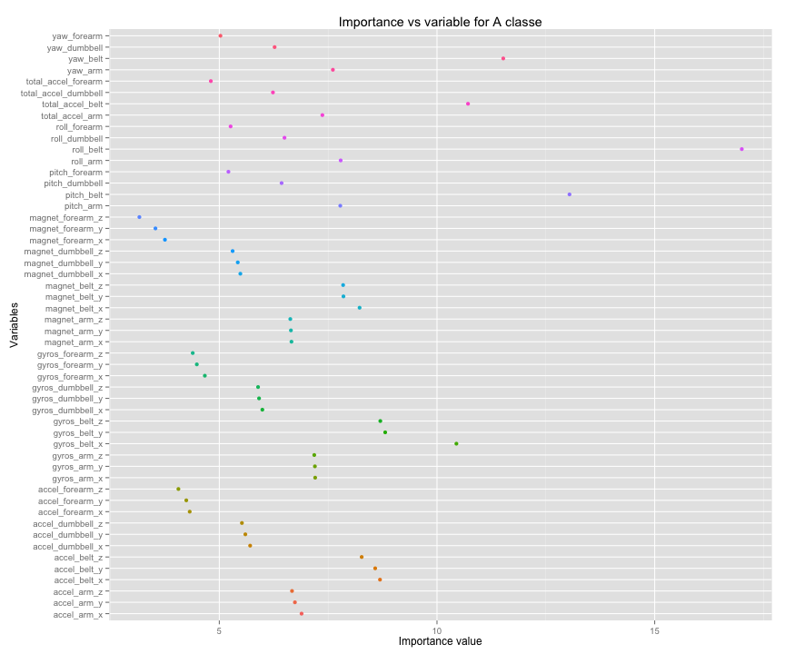
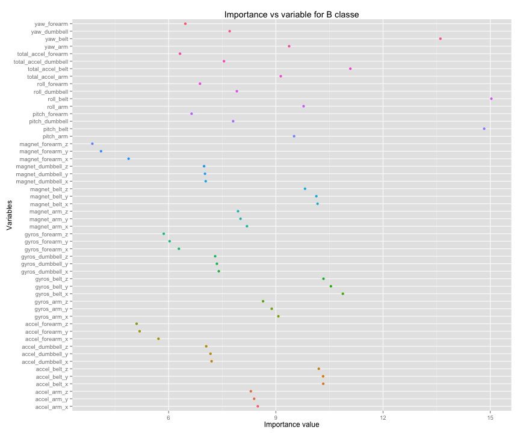
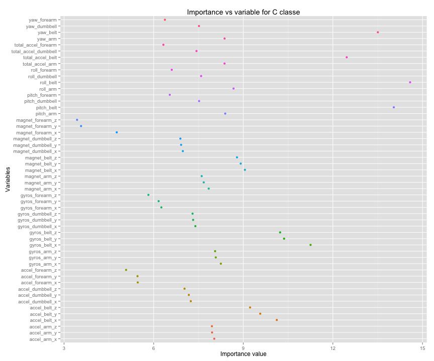
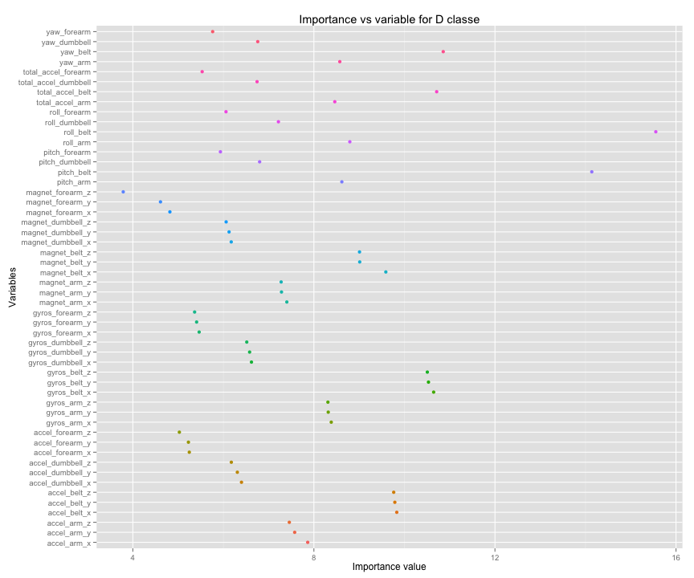
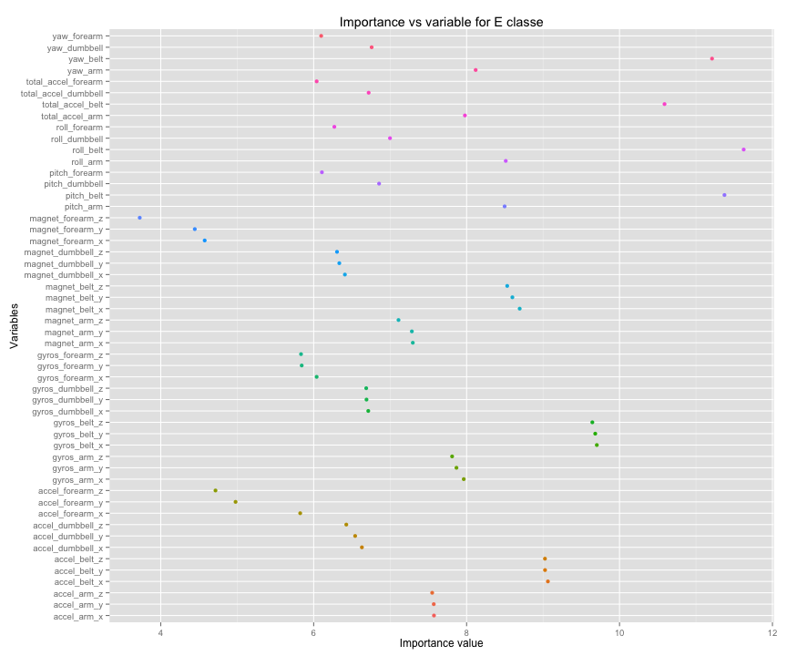

Predicting the exercise pattern - Machine Learning Assigment

========================================================
Author - Santhosh Ladalla

The devices such as Jawbone Up, Nike FuelBand, and Fitbit it is now possible to collect a large amount of data about personal activity relatively inexpensively.In this project, the goal is to use data from accelerometers on the belt, forearm, arm, and dumbell of 6 participants. They were asked to perform barbell lifts correctly and incorrectly in 5 different ways.In this project we will build a model using a machine learning algorithm and also perform cross validation to calculate out of sample error.

The steps in this project are

1.Download and read the data
2.features reduction
3.Create Partition data for cross validation
4.Building the model
5.Predict on partition test data
6.Calculate the out of sample error

Download and read the data
------------------------

I used read.csv command with treating NA,#Div/0! and empty spaces as NA.


```r
url <- 'https://d396qusza40orc.cloudfront.net/predmachlearn/pml-training.csv'
if (!file.exists('pml-training.csv')){
download.file(url, destfile = "./pml-training.csv", method="curl")
}
train<-read.csv("pml-training.csv", na.strings = c("NA", "#Div/0!", ""))
```

Feature reduction
------------------------

Based on the data,the below fields are specific to the data captured and it makes sense to ignore them in the model.Otherwise,we will see overfitting in model which causes the prediction to perform incorrectly.

* row number 
* user_name  
* raw_timestamp_part_1	
* raw_timestamp_part_2	
* cvtd_timestamp	
* new_window	
* num_window

The below code is used to find and ignore the columns which have greater then 80% of its values as NA.


```r
options(warn=-1)
c <- c()
for (i in 8:160 ) { w= sum(is.na(train[,i]))/nrow(train)
if (w>0.8) {c <- append(c,i)} }
train_1 <- train[,-c(1:7,c)]
```

Create partition data for cross validation
------------------------
The below code creates a data set with 70 % of the data to create a model and 30 % for cross validation.


```r
options(warn=-1)
library("caret")
```

```
## Loading required package: lattice
## Loading required package: ggplot2
```

```r
trainval <- createDataPartition(y=train_1$classe,p=0.7,list=FALSE)
rftrain <- train_1[trainval,]
rftest <- train_1[-trainval,]
```

Building the model
------------------------

I used random forest to building the model and predict classe variable from the cv data set.I used 52 variables after reducing the features.I used 50 trees and number of variables for each split is 5 along with the accessing the importance at each split.


```r
options(warn=-1)
set.seed(415)
library("randomForest")
```

```
## randomForest 4.6-10
## Type rfNews() to see new features/changes/bug fixes.
```

```r
library("ggplot2")
rfmodel <- randomForest(classe ~ . , data=rftrain,ntree=50,mtry=5,importance=TRUE )
imp <- varImp(rfmodel)
```

Predicting and out of sample error
------------------------
The below code calculates the out of sample error using the partitioned test data.The out of sample error is 0.004927782 which is very less close to 0.


```r
options(warn=-1)
rftest_pred <- predict(rfmodel,rftest)
table(rftest_pred,rftest$classe)
```

```
##            
## rftest_pred    A    B    C    D    E
##           A 1672    5    0    0    0
##           B    2 1130    2    0    0
##           C    0    4 1018    6    0
##           D    0    0    6  958    5
##           E    0    0    0    0 1077
```

```r
Out_of_sample_error = 29/nrow(rftest)
```

Plots
------------------------

The below plots shows the variable importance for each classe


```r
qplot(imp[order(-imp[,1]) ,1], rownames(imp), colour = rownames(imp),fill = F) + theme(legend.position="none") +xlab("Importance value") + ylab("Variables") +
ggtitle("Importance vs variable for A classe")
```

 


```r
qplot(imp[order(-imp[,2]) ,2], rownames(imp), colour = rownames(imp),fill = F) + theme(legend.position="none") +xlab("Importance value") + ylab("Variables") +
ggtitle("Importance vs variable for B classe")
```

 


```r
qplot(imp[order(-imp[,3]) ,3], rownames(imp), colour = rownames(imp),fill = F) + theme(legend.position="none") +xlab("Importance value") + ylab("Variables") +
ggtitle("Importance vs variable for C classe")
```

 


```r
qplot(imp[order(-imp[,4]) ,4], rownames(imp), colour = rownames(imp),fill = F) + theme(legend.position="none") +xlab("Importance value") + ylab("Variables") +
ggtitle("Importance vs variable for D classe")
```

 


```r
qplot(imp[order(-imp[,5]) ,5], rownames(imp), colour = rownames(imp),fill = F) + theme(legend.position="none") +xlab("Importance value") + ylab("Variables") +
ggtitle("Importance vs variable for E classe")
```

 


